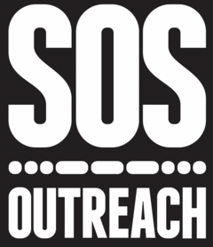

<!-- README.md is generated from README.Rmd. Please edit that file -->

# sosRus <a href="https://ztimpe.github.io/sosRus/"></a>

<!-- badges: start -->

[](https://github.com/ztimpe/sosRus/actions/workflows/R-CMD-check.yaml)
<!-- badges: end -->

The goal of sosRus is to tame some gnarly survey data! The functions
included in this package are designed to ease the burden of pulling data
from the SOS API and clean it in preparation for reporting and
evaluation.

## Installation

You can install the development version of sosRus from
[GitHub](https://github.com/) with:

``` r
# install.packages("devtools")
devtools::install_github("ztimpe/sosRus")
```

## Example

This is a basic example which shows you how to construct the API call:

``` r
library(sosRus)
# Use the table_fields function to load a list of character vectors for pulling 
# from the API. Check for accuracy.
table_fields <- table_fields()
```

``` r
# Use bracketize to add brackets, slashes, and quotations for the API call
bracketize(table_fields()[1])
#> Warning in bracketize(table_fields()[1]): Provided list is of length greater
#> than 1: only first bin is selected
#> [1] "[\"participants_id\",\"sessions_id\",\"organizations_id\",\"sessions_groups_id\",\"dob\",\"gradeLevelInSchool\",\"numberOfServiceDays\",\"totalDays\",\"totalFFS\",\"endOfSeason\",\"calc_high_risk\",\"pre\",\"participantNeeds\",\"strengths_academicGoals\",\"strengths_activityEngagement\",\"strengths_adultDrugUse\",\"strengths_adultPrison\",\"strengths_anger\",\"strengths_arguments\",\"strengths_behaviorProblems\",\"strengths_bully\",\"strengths_challenges\",\"strengths_difficultyFocusing\",\"strengths_drugUse\",\"strengths_englishSecondLang\",\"strengths_freeReducedLunch\",\"strengths_friendsDrugs\",\"strengths_friendships\",\"strengths_indCompleting\",\"strengths_juvie\",\"strengths_learningDisability\",\"strengths_lives\",\"strengths_mentalHealth\",\"strengths_physicalActivity\",\"strengths_positiveSelfEsteem\",\"strengths_schoolInterest\",\"strengths_victimBullying\",\"strengths_other,updatedDate\"]"
```
